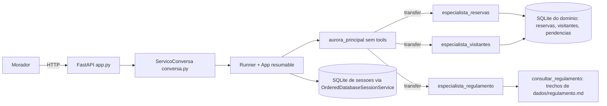

# Aurora: assistente virtual do Residencial Aurora

Assistente em Google ADK (série 2, versão exata 2.9.2 fixada em [pyproject.toml](pyproject.toml) e [uv.lock](uv.lock)) exposto por uma API FastAPI em `http://localhost:8000`. O modelo conduz a conversa; as regras críticas ficam no código e continuam valendo seja qual for o texto do morador.

## Arquitetura



| Agente | Responsabilidade | Como é acionado | Por quê |
| --- | --- | --- | --- |
| `aurora_principal` ([principal.py](src/aurora/agentes/principal.py#L38)) | Recebe o morador e roteia. Não tem tools. | Raiz do `App`. | Sem tools e sem regulamento no prompt: a raiz não executa ações e o histórico fica leve. |
| `especialista_reservas` ([especialistas.py](src/aurora/agentes/especialistas.py#L28)) | Disponibilidade, reservar, cancelar, listar reservas. | `transfer_to_agent` da raiz. | A tool com confirmação (taxa) precisa viver num especialista: o replay da confirmação reexecuta o agente que a pediu, e na raiz isso falhava (spikes `spike_confirmacao/` e `spike_resume/`). |
| `especialista_visitantes` ([especialistas.py](src/aurora/agentes/especialistas.py#L43)) | Autorizar e listar visitantes. | `transfer_to_agent`. | `autorizar_visitante` sempre confirma; mesma razão. |
| `especialista_regulamento` ([especialistas.py](src/aurora/agentes/especialistas.py#L57)) | Responde dúvidas citando só o trecho devolvido pela tool. | `transfer_to_agent`. | Isola a consulta ao regulamento (Garantia 4). |

Todos usam `gemini-3.5-flash` por padrão (`AURORA_MODEL` troca). As instruções estão em [instrucoes.py](src/aurora/agentes/instrucoes.py). Tools de reservas, visitantes e regulamento em [src/aurora/tools/](src/aurora/tools/); dados em [src/aurora/dados/](src/aurora/dados/); rotas em [app.py](src/aurora/api/app.py) e regras de conversa em [conversa.py](src/aurora/api/conversa.py).

Armazenamento: dois arquivos SQLite em `var/`. `dominio.sqlite3` guarda reservas, visitantes e pendências de confirmação; `sessions.sqlite3` guarda as sessões do ADK. Rode a API com **um único processo**: `scripts/subir.py` usa o padrão do uvicorn (um processo), então não passe `--workers`. O serializador de eventos assume um processo escritor por sessão.

## Garantias

Cada garantia aponta onde está o código e por que não depende do que o modelo decide.

### 1. Cobrança ou acesso só com confirmação

- A tool declara a exigência, não o prompt: [`reservar_exige_confirmacao`](src/aurora/tools/reservas.py#L91) devolve `True` quando a taxa da área é maior que zero e é ligada em [reservas.py](src/aurora/tools/reservas.py#L205); [`autorizar_visitante`](src/aurora/tools/visitantes.py#L90) usa `require_confirmation=True`. O ADK interrompe a execução antes da tool rodar e emite o evento `adk_request_confirmation`.
- A pendência vem do evento do sistema ([`_pendencias_do_evento`](src/aurora/api/conversa.py#L140)) e é gravada na tabela de pendências. Dizer "já confirmei" no texto não cria nem resolve pendência.
- Só a rota `POST /sessoes/{id}/confirmacoes` retoma a execução, com um `FunctionResponse` montado pelo servidor ([conversa.py](src/aurora/api/conversa.py#L125)). A transição `pendente` para `processando` é atômica ([`iniciar_processamento`](src/aurora/dados/pendencias.py#L179)); se falhar, o serviço levanta `ConfirmacaoInexistente` ([conversa.py](src/aurora/api/conversa.py#L335)) e a rota devolve `409`. Isso cobre id inexistente, de outra sessão e já respondido.
- Texto novo com pendência aberta cancela a pendência ([conversa.py](src/aurora/api/conversa.py#L296)); queda no meio da aprovação volta ao estado pendente ([`recuperar_processando`](src/aurora/dados/pendencias.py#L241)).

### 2. Cada sessão pertence a um apartamento

- O apartamento entra uma vez, no `state` da sessão ([conversa.py](src/aurora/api/conversa.py#L271)). Nenhuma tool tem parâmetro de apartamento. As que leem ou gravam dados do morador (`reservar_area`, `cancelar_reserva`, `listar_minhas_reservas`, `autorizar_visitante`, `listar_meus_visitantes`) obtêm o apartamento de `tool_context.state` ([`_apartamento_da_sessao`](src/aurora/tools/reservas.py#L73) e [`_sessao_valida`](src/aurora/tools/reservas.py#L84)). `consultar_disponibilidade` e `consultar_regulamento` não leem a sessão: não recebem nem devolvem dado de apartamento.
- Reserva de outro apartamento e reserva inexistente dão a mesma resposta (`nao_encontrada`) em [`cancelar_reserva`](src/aurora/tools/reservas.py#L157). [`consultar_disponibilidade`](src/aurora/tools/reservas.py#L106) devolve só livre ou ocupada, nunca de quem é.
- As instruções reforçam a recusa, mas a garantia é estrutural: mesmo que o modelo aceite a história "sou do 302", a tool continua lendo o apartamento da sessão.
- Além disso, uma fala que cita o número de **outro** apartamento, com uma pista de que é um apartamento ("apto 302", "do 302", "unidade 201"), é barrada em código ([`_cita_outro_apartamento`](src/aurora/api/conversa.py#L75), usada em [conversa.py](src/aurora/api/conversa.py#L290)): recebe uma resposta fixa, não chega ao modelo e não entra na sessão. Números sem pista ("R$ 302,00", "lote 302") seguem normalmente. Isso evita que a tentativa antiga contamine os pedidos seguintes da conversa; é uma mitigação, não a garantia, e não pega formas como "trezentos e dois", que continuam com o modelo e as tools.

### 3. Nada se perde no reinício

- Sessões e eventos ficam em SQLite via [`OrderedDatabaseSessionService`](src/aurora/runtime/servico_ordenado.py#L37), que contorna um bug de ordem de eventos do `DatabaseSessionService` do ADK 2.9.2 que fazia a aprovação de confirmação ser engolida (provado em `spike_confirmacao/`).
- O `App` é resumable ([fabrica.py](src/aurora/runtime/fabrica.py#L60)). Reservas, visitantes e pendências estão no banco do domínio.
- O código de reserva vem de uma sequência persistente ([dominio.py](src/aurora/dados/dominio.py#L221)) que nunca regride, nem na restauração ([`restaurar`](src/aurora/dados/dominio.py#L178)). Por isso um código não se repete, mesmo de reserva cancelada.

### 4. O regulamento é consultado, não carregado

- A raiz não tem tools ([principal.py](src/aurora/agentes/principal.py#L38)) e o regulamento não está nas suas instruções: [`INSTRUCAO_PRINCIPAL`](src/aurora/agentes/instrucoes.py#L33) só descreve para quem transferir.
- [`consultar_regulamento`](src/aurora/tools/regulamento.py#L747) busca por relevância e devolve no máximo [3 trechos](src/aurora/tools/regulamento.py#L32). Só esses trechos entram nos eventos; o arquivo inteiro nunca vai para o histórico.
- Limite honesto: a busca é lexical, então o que entra nos eventos é o que ela ranqueia como relevante; ela erra para frases muito indiretas, por isso o especialista reformula a pergunta com termos formais do regulamento ([`INSTRUCAO_REGULAMENTO`](src/aurora/agentes/instrucoes.py#L101)).

### 5. Dois moradores, uma reserva

- A exclusividade vale no instante da gravação: índice `UNIQUE` parcial [`ux_reservas_ativa`](src/aurora/dados/dominio.py#L112) sobre `(area, data) WHERE ativa=1`. [`gravar_reserva`](src/aurora/dados/dominio.py#L261) captura o `IntegrityError` ([L290](src/aurora/dados/dominio.py#L290)) e devolve `recusada` como resposta normal.
- O spike [`spike_concorrencia/`](spike_concorrencia/RESULTADO-CONCORRENCIA.md) comparou estratégias: SELECT seguido de INSERT e lock em memória falham sob concorrência; o índice único e `BEGIN IMMEDIATE` tiveram 0 falhas em 3 rodadas. A API usa o índice único (a gravação roda em `BEGIN`, sem `BEGIN IMMEDIATE`).
- A tool só converte a recusa em texto; quem decide é o banco.

## Como rodar

Pré-requisitos: Python 3.12 ou superior, [uv](https://docs.astral.sh/uv/) e uma chave do Google AI Studio.

```bash
uv sync
cp .env.example .env        # preencha GOOGLE_API_KEY
uv run python scripts/restaurar.py   # restaura reservas, visitantes e pendências ao estado de dados/
uv run python scripts/subir.py       # API em http://localhost:8000 (Ctrl+C para parar)
```

Variáveis do `.env` (só `GOOGLE_API_KEY` é obrigatória; o resto tem padrão):

| Variável | Padrão | Uso |
| --- | --- | --- |
| `GOOGLE_API_KEY` | (obrigatória) | Chave do AI Studio. O `.env` fica fora do Git. |
| `AURORA_MODEL` | `gemini-3.5-flash` | Modelo dos agentes. |
| `AURORA_SESSION_DB` | `var/sessions.sqlite3` | Banco de sessões. |
| `AURORA_DOMAIN_DB` | `var/dominio.sqlite3` | Reservas, visitantes e pendências. |
| `AURORA_DADOS_DIR` | `dados/` | Pasta com os JSON iniciais. |
| `AURORA_REGULAMENTO_PATH` | `dados/regulamento.md` | Regulamento. |

Comandos úteis:

- **Restaurar dados:** `uv run python scripts/restaurar.py`. Preserva as sessões. Com `--sessoes` apaga também o banco de sessões (a API precisa estar parada). A sequência de códigos de reserva não regride.
- **Reiniciar sem perder nada:** pare com Ctrl+C e rode `scripts/subir.py` de novo, sem restaurar.
- **Verificar os dados iniciais:** `uv run python -m aurora.dados.carregar --verificar`.
- **Dados do condomínio:** `dados/` é o estado inicial e a aplicação nunca o altera (hashes em [PROTECTED-MANIFEST.json](PROTECTED-MANIFEST.json)). O `.env` está no `.gitignore`; o `.env.example` só traz nomes.
- **Verificação das rotas sem chamar o modelo:** `uv run python -m aurora.api.smoke_rotas` (usa um modelo falso e bancos temporários).
- **Fluxo completo do avaliador (15 passos):** `uv run python scripts/verificar_fluxo.py --subir -v`. Restaura dados e sessões, sobe a API, reinicia no passo 13 e reporta OK ou FALHA por passo. Usa o Gemini real (algumas dezenas de chamadas); sem `--subir`, verifica uma API já no ar.

Rotas: `POST /sessoes`, `POST /sessoes/{id}/mensagens`, `POST /sessoes/{id}/confirmacoes`, `GET /sessoes/{id}/eventos`, `GET /apartamentos/{n}/reservas`, `GET /apartamentos/{n}/visitantes`. As duas últimas leem o banco direto, sem modelo.

### Estado de validação

- Cobertos pelo modelo falso ([smoke_rotas.py](src/aurora/api/smoke_rotas.py)), com bancos temporários: as rotas do contrato, a confirmação (pendência, negar, aprovar, reenvio e id inexistente com 409), a autorização de visitante, os eventos da sessão, a disputa pela mesma reserva, a guarda de outro apartamento e a recuperação de turno vazio do modelo (uma nova tentativa, sem repetir tool já executada). O isolamento por apartamento é estrutural (garantia 2).
- Com o Gemini real (`gemini-3.5-flash`), o fluxo do avaliador (`scripts/verificar_fluxo.py --subir`) deu 15/15 em 5 de 5 execuções seguidas com a primeira versão da guarda de outro apartamento (cerca de 95 mil tokens e 30 chamadas por execução). Antes dela, nas 10 execuções válidas do mesmo dia, 5 deram 15/15; as falhas eram o modelo recusando um pedido do próprio apartamento por causa de uma tentativa anterior com outro número (passo 11) e um turno vazio no passo 12. Com a guarda atual, mais estreita (exige a pista de apartamento), e a versão 3 do verificador, mais 3 execuções reais deram 15/15 (cerca de 94 mil tokens cada). A nova tentativa em turno vazio está coberta pelo modelo falso, mas **não chegou a disparar** nas execuções reais. Cinco execuções são uma amostra pequena e o comportamento do modelo é estocástico: rode o fluxo do avaliador com a sua chave antes de confiar no roteamento.
- Sem testes automatizados além dos roteiros de smoke em `src/aurora/**/smoke_*.py`, conforme o escopo do enunciado.
